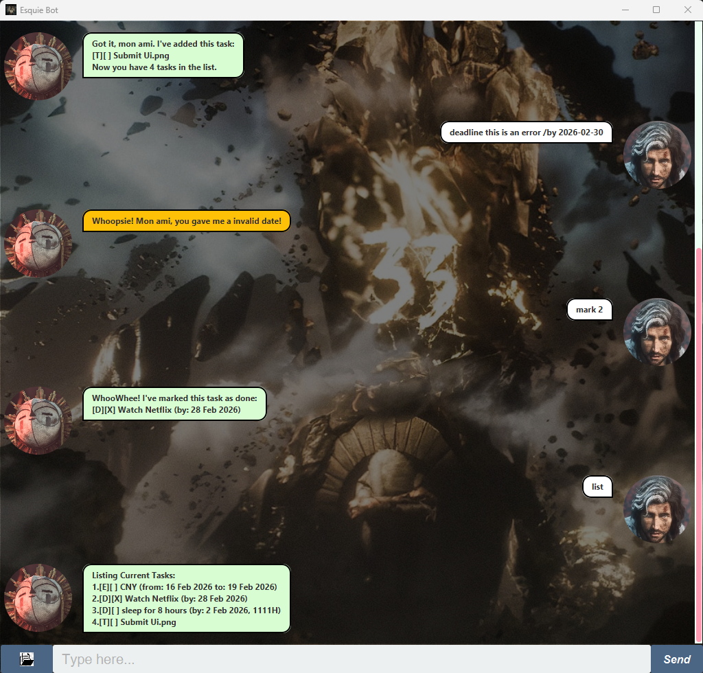

# Esquie User Guide
### Esquie is a desktop app for managing tasks, optimized for use via a Command Line Interface (CLI). <br><br>If you can type fast, Esquie can get your task recorded and tracked faster than traditional GUI apps!


# 1. Features
* Add different types of tasks (todo, deadline, event)
* View all tasks in the task list
* Delete task from task list
* Mark/Unmark task as done/not done
* Find task(s) related to a keyword

# 2. Commands
### 2.1 Adding todo: `todo`
Adds a task that needs to be done.
* **Format:** `todo <task description>`
* **Examples:**`todo return book `

If the operation was successful, a success message will be shown:
```
Got it, mon ami. I've added this task:
[T][] return book
Now you have 1 tasks in the list.
```

### 2.2 Adding deadline: `deadline`
Adds a task that needs to be done before a specific date / time (optional).
* **Format:** `deadline <task description> /by <date> [time]`
  * `<date>` format follows `YYYY-MM-DD` format.
  * `[time]` (optional) must be in `HHmm` (24 hour) format.
* **Examples:**
  1. **Without Time:** `deadline return book /by 2026-02-18`
  2. **With Time:** `deadline return book /by 2026-02-18 1800`

If the operation was successful, a success message will be shown:
```
Got it, mon ami. I've added this task:
[D][] return book (by: 18 Feb 2026, 1111H) 
Now you have 1 tasks in the list.
```

### 2.3 Adding event: `event`
Adds a task that takes up a specific date / time (optional) period.
* **Format:** `event <task description> /from <date> [time] /to <date> [time]`
    * `<date>` format follows `YYYY-MM-DD` format.
    * `[time]` (optional) must be in `HHmm` (24 hour) format.
* **Examples:**
    1. **Without Time:** `event return book /from 2026-02-18 /to 2026-02-25`
    2. **With Time:** `event return book /from 2026-02-18 1800 /to 2026-02-25 1800`

If the operation was successful, a success message will be shown:
```
Got it, mon ami. I've added this task:
[E][] return book (from: 18 Feb 2026, 1800H to: 25 Feb 2026, 1800H) 
Now you have 1 tasks in the list.
```

### 2.4 Listing all tasks: `list`
Shows a list of all tasks in the current task list.
* **Format:** `list`

### 2.5 Finding task(s): `find`
Shows a list of all tasks that contains the given keyword.
* **Format:** `find <keyword>`
* **Examples:** `find co` returns task(s) with the description containing substring `co`

### 2.6 Marking and Unmarking task: `mark` and `unmark`
Marks/Unmarks a task given its index in the list
* **Format:** 
  1. `mark <index>`
  2. `unmark <index>`
* **Examples:**
  1. `mark 1` marks the task with index 1 as completed
  2. `unmark 1` unmarks the task with index 1 as completed

If the operation was successful, a success message will be shown:
```
WhooWhee! I've marked this task as done:
[T][X] read book

WhooWhee! I've marked this task as not done yet:
[T][] read book
```

### 2.7 Deleting task: `delete`
Deletes a task given its index
* **Format:** `delete <index>`
* **Examples:** `delete 1` deletes the task with index 1

If the operation was successful, the deleted task and the remaining count will be shown:
```
Got it, mon ami. I've removed this task:
[T][] read book
Now you have 1 tasks in the list.
```

### 2.8 Exit from the program: `bye`
Exit from the program
* **Format:** `bye`